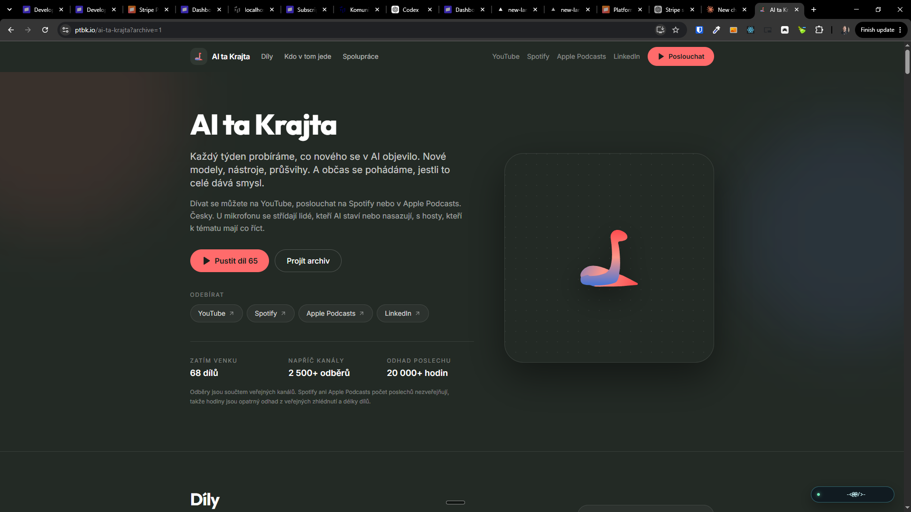

[x] by Claude Code `claude-opus-5` thinking `max` - Implementation $24.62 2 hours; Testing 3 minutes

[✨🧓] Make page `/ai-ta-krajta`

- This will be a page for the AI Ta Krajta podcast
- https://www.youtube.com/@aitakrajta_tv

- There should be:

0. The Header with the logo and navigation to the other pages of the podcast
    - The primary call to action button should be "Poslouchat" and it should lead to the last episode of the podcast which will be automatically started to play when the user clicks on it in the mini player on the bottom of the page.
1. Basic information about the podcast, where and how to subscribe
    - Do there something funny and playful: For example, make there a snake which is live and interactive, beginning as a logo.
    - Is there some Snake mini-game, but not in a grid, but similar to the snake.io
    - But everything should be branded in a podcast style and colors
2. List of the episodes And you should be able to listen to the episode directly on the page.
    - There should be some mini player fixed on bottom when the episode is played.
    - Feed it from https://anchor.fm/s/104a797ac/podcast/rss
    - In each episode, there should be a small circle with the people starring in this episode.
3. Information about the hosts and guests
    - There should be a bigger profile card with that person.
    - You click on that person. It should filter the episode with this person.
    - Save this filtration (and any other state of the page) to the get parameters.
4. Information about how to collaborate with the podcast, how to become a guest, and how to request new topics for future episodes, sponsorship, and other collaborations.
    - The lead from the partnership should lead to the contacts in `/admin`
5. Legal footer (look at other pages for inspiration)

- The page should have all the metadata for SEO and social media sharing, including Open Graph and Twitter Card tags,...
- Keep in mind the DRY _(don't repeat yourself)_ principle.
- Do a proper analysis of existing pages before you start implementing.
    - Try to reuse the components but not the whole page, because the page is for unique project

**Here are some raw notes: **

```
Landing page, které budou sloužit pro prezentaci podcastu, jako zdroj veškerých informací o tom, jak s námi spolupracovat, jak se případně stát hostem a jak požádat o nová témata. do budoucna pro nás. .

Prezentační landing page, kde bude o tom, co je AI ta krajta, kde nás všude lidi najdou.

Dáme tam ten one-pager jako záložku pro firmy, aby jsme jasně komunikovali i ceny, aby přesně věděli transparentně: „Hej, za tolik dostanete tohle a tohle.“

A případně jak se stát hostem, že nám mají jako napsat na sockách.

Udělám to takhle minimalisticky. Back office bych řešil potom.
```


**And here how to avoid sloppiness:**

- Avoid bullshit things like badges like "Český video podcast o AI"
  

```markdown
# Unslop

Edit text to remove AI patterns and add human voice.

## Process

1. Scan for the patterns below.
2. Rewrite. Preserve meaning, match intended tone.
3. Add soul (see next section).
4. Self-audit: "What makes this obviously AI generated?" Fix remaining tells.

## Adding soul

Removing patterns is half the job. Sterile, voiceless writing is just as obvious.

- **Have opinions.** React to facts instead of neutrally listing pros and cons.
- **Vary rhythm.** Short sentences. Then longer ones that take their time. Mix it up.
- **Acknowledge complexity.** "Impressive but also kind of unsettling" beats "impressive."
- **Use "I" when it fits.** First person isn't unprofessional.
- **Let some mess in.** Perfect structure looks machine-made.
- **Be specific.** Not "this is concerning" but "there's something unsettling about agents churning away at 3am."

## Patterns to detect and fix

### Content

1. **Puffery.** "pivotal moment", "testament to", "evolving landscape", "setting the stage for", "indelible mark", "deeply rooted". Cut puffery, state what happened.
2. **Name-dropping.** Listing media outlets without context. Pick one, say what was said.
3. **Superficial -ing phrases.** "highlighting...", "ensuring...", "reflecting...", "showcasing...", "fostering...". Delete or expand with real sources.
4. **Promotional language.** "nestled", "vibrant", "breathtaking", "groundbreaking", "renowned", "stunning", "must-visit". Use neutral descriptions.
5. **Vague attributions.** "Experts believe", "Industry reports suggest", "Some critics argue". Name the source or delete.
6. **Formulaic challenges.** "Despite challenges... continues to thrive." Replace with specific facts.

### Language

7. **AI vocabulary.** Additionally, crucial, delve, enduring, enhance, fostering, garner, interplay, intricate, landscape (abstract), pivotal, showcase, tapestry (abstract), testament, underscore, vibrant. Replace with plain words.
8. **Fancy ways to say "is".** "serves as", "stands as", "boasts", "features". Just say "is" or "has".
9. **"Not just X, but Y."** State the point directly instead.
10. **Rule of three.** Forcing ideas into groups of three. Use the natural number.
11. **Synonym cycling.** Protagonist, main character, central figure, hero all in one paragraph. Pick one, repeat it.
12. **False ranges.** "from X to Y" where X and Y aren't on a meaningful scale. List topics directly.

### Style

13. **Em dash overuse.** Avoid em dashes entirely. Use periods or commas only (no parentheses, no en dashes, no hyphen-as-dash substitutes). Em dashes are an AI tell, and reaching for parentheses instead just trades one tell for another. If a thought needs separation, end the sentence or use a comma.
14. **Colon overuse.** Colons are fine before a list or example. Not as mid-sentence connectors. "If you're coming from traditional automation: instead of registering event handlers, you describe conditions" adds nothing with the colon. Rewrite to let the point stand on its own without comparison framing. "Describing when the scheduler should fire works best as plain English." Same meaning, no crutch punctuation.
15. **Boldface overuse.** Don't bold every proper noun or acronym.
16. **Inline-header lists.** The tell is a bold label and colon that restates the line: "**Performance:** Performance improved...". Convert those to prose. A bold lead-in that ends in a period, names the item, and is followed by genuinely new detail ("**Schema in TypeScript.** Tables live in one file.") is fine, not a tell.
17. **Title case headings.** Use sentence case.
18. **Decorative emojis.** Remove from headings and bullets.
19. **Curly quotes.** Replace with straight quotes.

### Communication artifacts

20. **Chatbot phrases.** "I hope this helps!", "Let me know if...", "Of course!", "Certainly!", "Found the smoking gun!" Remove.
21. **Cutoff disclaimers.** "While specific details are limited..." Find sources or remove.
22. **Sycophantic tone.** "Great question! You're absolutely right!" Respond directly.

### Filler

23. **Filler phrases.** "In order to" becomes "To". "Due to the fact that" becomes "Because". "It is important to note that" gets deleted.
24. **Excessive hedging.** "could potentially possibly be argued that it might" becomes "may".
25. **Generic conclusions.** "The future looks bright." State specific plans or facts.

### Jargon

26. **Abstract metaphor nouns.** Substrate, wedge, vector, locus, vantage, nexus, primitive (as noun), harness (as metaphor), surface (as in "API surface"), bedrock, scaffolding (as metaphor), modality, paradigm, gold-plating, ratchet (as metaphor), evacuate (for moving code), endgame, north star, flywheel. These read as technical but usually have a plainer concrete word. "Substrate" becomes "base". "Wedge in" becomes "add". "Vector" becomes "way" or "method". "Gold-plating" becomes "more than the job needs". "Ratchet" becomes the mechanism's real name or "a limit that only tightens". "Evacuate" becomes "move out". "Endgame" becomes "the last phase". Pick the concrete word.

### Plain speech

27. **Say what it does, not how it feels.** "the database stays close at hand", "SQL you can read", "types that follow your schema" name a feeling. The fix names the mechanism or a number: "`.toSQL()` returns the exact string sent to the database", "a column rename fails the build". Ask what the sentence tells the reader to do or know, then write that. If you can't restate it as a concrete instruction, fact, or number, cut it. One more check: if the sentence could appear unchanged in another project's docs, it says nothing about this one. Cut it.
28. **Shorten or split dense sentences.** If the reader has to backtrack to parse a sentence, break it in two or drop clauses. One idea per sentence.
29. **Active voice.** Prefer it. Catch "is/are/was/were + past participle" and name the actor: "queries are validated" becomes "the compiler validates queries", "the file is parsed by the loader" becomes "the loader parses the file". Passive is fine only when the actor is unknown or genuinely doesn't matter.
30. **Cut adverbs, or use a stronger verb.** "runs quickly" becomes "is fast" or the number. "significantly improves" becomes the measured delta. An adverb propping up a weak verb means the verb is wrong.
31. **Prefer the plain word.** "utilize" becomes "use", "leverage" becomes "use", "facilitate" becomes "help", "numerous" becomes "many", "in the event that" becomes "if". The fancier synonym is rarely clearer.
```

---

[x] by OpenAI Codex `gpt-5.6-terra` thinking `max` (ChatGPT account) - Implementation ~$0.6131 29 minutes; Testing 8 minutes

[✨🧓] Change favicon on page `/ai-ta-krajta`

- All the metadata favicons sharing,... etc of the AI ta Krajta page should be branded as AI ta Krajta, not as Promptbook
- Favicon should be the logo of the podcast
- Also add 🐍 to title and metadata
- Only thing referring to Promptbook is the legal company AI Web in the footer.
- You are working with page `/ai-ta-krajta`
- Keep in mind the DRY _(don't repeat yourself)_ principle.
- Do a analysis of the current functionality before you start implementing.

---

[x] by Claude Code `claude-opus-5` thinking `max` - Implementation $7.48 18 minutes; Testing 6 minutes

[✨🧓] Fix the ugly corners of favicon in `/ai-ta-krajta`

- You are working with page `/ai-ta-krajta`


---

[x] by OpenAI Codex `gpt-5.6-terra` thinking `max` (ChatGPT account) - Implementation ~$0.3582 13 minutes; Testing 8 minutes

[✨🧓] GET parameters on page `/ai-ta-krajta` must be in english and behave bit differently

- Whether the minigame is turned on or off should be only a local state, not the get state.
- What section you are scrolled should be done by the hash not get parameters.
- The filtration should be done by get parameters, but keys should be in English.
- You are working with page `/ai-ta-krajta`
- Keep in mind the DRY _(don't repeat yourself)_ principle.
- Do a analysis of the current functionality before you start implementing.

---

[x] by OpenAI Codex `gpt-5.6-terra` thinking `max` (ChatGPT account), started by Claude Code `claude-opus-5` thinking `max` - Implementation ~$0.3108 9 minutes; Testing 6 minutes

[✨🧓] Primary link of the episode of `/ai-ta-krajta` should be on YouTube

- "Otevřít u vydavatele" should lead to YouTube to that particular episode video
- Still source them from RSS feed
- There should be also internal JSON list of episodes hardcoded for fallback purposes and additional information
- The episodes are sourced from multiple sources
    1. The RSS feed
    2. The internal JSON list of episodes
    3. YouTube
- The backend should autonmatically merge the episodes from all sources and send to client as merged list with maximum available information for each episode, ensuring no duplicates and prioritizing the most complete data.
- Fetching of the external sources should be cached on the server to reduce load times and avoid unnecessary repeated requests.
- The playing of the audio is done on client side and client browser touches directly the audio source from the RSS (but not download the RSS file itself)
    - Server fetches RSS feed -> Combines with internal JSON list and YouTube data -> Sends merged list to client -> Client has link to the actual audio source (which is from the RSS feed)
- You are working with page `/ai-ta-krajta`
- Keep in mind the DRY _(don't repeat yourself)_ principle.
- Do a analysis of the current functionality before you start implementing.

---

[x] by OpenAI Codex `gpt-5.6-terra` thinking `max` (ChatGPT account) - Implementation ~$0.00 23 minutes; Testing 6 minutes

[✨🧓] Better statistics of `/ai-ta-krajta`

- Now the statistics are a little bit boring.
- Keep showing number of the episodes.
- But show number of total listeners / subscribers. Do not source only from the YouTube, but try to make some good estimation from all the platforms.
    - to some roughly rounding, for example 4500+ listeners
    - Also try to aggregate total listened time, for example 10 000+ hours listened
    - Theese numbers are just examples and should be replaced with actual aggregated data from all sources.
- Fetching of the external sources should be cached on the server to reduce load times and avoid unnecessary repeated requests.
- The statistics information should be sourced this way:
    - Server fetches RSS feed and other online sources -> Combines with [internal JSON list](businesses/ai-ta-krajta/aiTaKrajtaEpisodes.json) -> Aggregates statistics -> Sends merged list and aggregated statistics to client
- You are working with page `/ai-ta-krajta`
- Keep in mind the DRY _(don't repeat yourself)_ principle.
- Do a analysis of the current functionality before you start implementing.

---

[x] by OpenAI Codex `gpt-5.6-terra` thinking `max` (ChatGPT account) - Implementation ~$0.7873 26 minutes; Testing 6 minutes

[✨🧓] Fix hosts listed on episodes in `/ai-ta-krajta`

- Lot of episodes have missing host information.
- Put the hosts to the `aiTaKrajtaEpisodes.json`
- The hosts information should be sourced this way:
    - Server fetches RSS feed and other online sources -> Combines with [internal JSON list](businesses/ai-ta-krajta/aiTaKrajtaEpisodes.json) -> Sends merged list to client
- When there is conflicting information between the external sources and the internal JSON list, the server should just merge hosts of that episode from both sources. Its better to show extra host which wasnt there then to miss a host that was in that episode.
- Fetching of the external sources should be cached on the server to reduce load times and avoid unnecessary repeated requests.
- Hosts are identified by their names, for example "Pavol Hejný".
- You are working with page `/ai-ta-krajta`
- Keep in mind the DRY _(don't repeat yourself)_ principle.
- Do a analysis of the current functionality before you start implementing.

**The item in `aiTaKrajtaEpisodes.json` should look like:**

```json
{
    "number": 64,
    "title": "AI ta Krajta #64 | Čtyři AI lídři opouštějí Google. Co chystá Discovery Loop?",
    "publishedAt": "2026-08-27T08:25:22.000Z",
    "durationInSeconds": 2134,
    "youtubeVideoId": "9kMN7t4kLNs",
    "hosts": ["Pavol Hejný", "Jiří Jahn", "Another Host"]
}
```


---

[x] by OpenAI Codex `gpt-5.6-terra` thinking `max` (ChatGPT account) - Implementation ~$0.5858 26 minutes; Testing 6 minutes

[✨🧓] Add full episodes transcriptions in `/ai-ta-krajta` for search purpose

- Put the full transcriptions to the `aiTaKrajtaEpisodes.json`
- Implemented in a way that the full transcriptions aren't transferred to the client but searchable on the server side, so that the user can search for a keyword and find the episode(s) where this keyword was mentioned.
- You are working with page `/ai-ta-krajta`

---

[-]

[✨🧓] Add střihač?

- @@@@@@

---

[x] by OpenAI Codex `gpt-5.6-terra` thinking `max` (ChatGPT account) - Implementation ~$0.2929 13 minutes; Testing 8 minutes

[✨🧓] Enhance minigame on page `/ai-ta-krajta`

- The snake must be continuous, not as many distinct dots.
- Remove "Sbírejte tokeny. Roste z nich.", the game and controls should be as simple as it can be.
- You are working with page `/ai-ta-krajta`
- Keep in mind the DRY _(don't repeat yourself)_ principle.
- Do a analysis of the current functionality before you start implementing.


---

[x] by OpenAI Codex `gpt-5.6-terra` thinking `max` (ChatGPT account) - Implementation ~$0.1791 7 minutes; Testing 6 minutes

[✨🧓] Simplify the controls of the minigame on page `/ai-ta-krajta`

- There should be not link button "Probudit", clicking on the snake should start the game immediately.
- There should be no button "Uspat", game should run indefinetly
- Show the points scored during the game
- You are working with page `/ai-ta-krajta`
- Keep in mind the DRY _(don't repeat yourself)_ principle.
- Do a analysis of the current functionality before you start implementing.

---

[x] by OpenAI Codex `gpt-5.6-terra` thinking `max` (ChatGPT account) - Implementation ~$0.2646 12 minutes; Testing 6 minutes

[✨🧓] Fix the bouncing to the boundaries in the minigame on page`/ai-ta-krajta`

- When the snake hits the boundary, there is an ugly flickering on that snake corner
- You are working with page `/ai-ta-krajta`
- Keep in mind the DRY _(don't repeat yourself)_ principle.
- Do a analysis of the current functionality before you start implementing.


---

[x] by OpenAI Codex `gpt-5.6-terra` thinking `max` (ChatGPT account) - Implementation ~$0.3079 11 minutes; Testing 6 minutes

---

[x] by Claude Code `claude-opus-5` thinking `max` - Implementation $0.00 5 hours; Testing 7 minutes

[✨🧓] Initial position of the snake on page `/ai-ta-krajta` should look 1:1 like the AI ta Krajta logo

- Now it looks somewhat like our logo but not exactly 1:1.
- Snake should start smoothly from the exact shape and position as the AI ta Krajta logo.
- Starting of the game should seamlessly transition from the logo shape into the playable snake.
- You are working with page `/ai-ta-krajta`
- Keep in mind the DRY _(don't repeat yourself)_ principle.
- Do a analysis of the current functionality before you start implementing.


---

- Allow snake to break free from boundaries
- Infinite edges - behave like torus in a loop @@@

---

[x] by Claude Code `claude-opus-5` thinking `xhigh` - Implementation 3.38 29 minutes; Testing 4 minutes

[✨🧓] Add pictures of all people on page `/ai-ta-krajta`

- Find the pictures of all people starring in the episodes and put them to the page `/ai-ta-krajta` in same way as there is picture of Pavol Hejný and Jiří Jahn
- You are working with page `/ai-ta-krajta`
- Keep in mind the DRY _(don't repeat yourself)_ principle.
- Do a analysis of the current functionality before you start implementing.

---

[x] by Claude Code `claude-opus-5` thinking `xhigh` - Implementation $3.09 an hour; Testing 4 minutes

[✨🧓] Order the people on page `/ai-ta-krajta` semi-randomly

- Use random shuffle but reflect the number of appearances of each person in the episodes, so that people with more appearances are more likely to be on top of the list.
- You are working with page `/ai-ta-krajta`
- Keep in mind the DRY _(don't repeat yourself)_ principle.
- Do a analysis of the current functionality before you start implementing.

---

[x] by OpenAI Codex `gpt-5.6-terra` thinking `max` (ChatGPT account) - Implementation ~$0.4758 15 minutes; Testing 5 minutes

[✨🧓] Enhance "Pojďme do toho spolu" section on page `/ai-ta-krajta`

- Look at `prompts/2026-08-0530-ai-ta-krajta-partnerstvi-handoff.md` and put it on the page in some simple and atractive way.
- Create a page `/ai-ta-krajta/media-kit` with detailed information about the podcast, how to become a guest, and how to request new topics for future episodes, sponsorship, and other collaborations,...
- The section "Pojďme do toho spolu" should deeplink to this `/ai-ta-krajta/media-kit` page.
- You are working with page `/ai-ta-krajta`
- Keep in mind the DRY _(don't repeat yourself)_ principle.
- Do a analysis of the current functionality before you start implementing.

---

[x] by OpenAI Codex `gpt-6-astra` thinking `max` (ChatGPT account) - Implementation ~$0.2583 17 minutes; Testing 8 minutes

[✨🧓] Add badge representing Promptbook coder to `/ai-ta-krajta`

- You are working with page `/ai-ta-krajta`
- Promptbook coder has page https://coder.ptbk.io/
- The badge should represent the Promptbook coder ASCII octopus (but in a simplified form suitable for a badge)
- Start with microterminal entering "$ ptbk"
- Then continue with `~<@@/>-` avatar octopus representing promptbook coder
    - "-" is representing the tentacles of the octopus / hands
        - Be creative with it, vary "-", "=", "~", "^", emdash "—" and other tentacle representations.
    - "@" is representing the eyes of the octopus / coder
        - Be creative with it, vary "o", "O", "0", ",", ".", "`", "()", "\*", "+", "◉", "◐", "◑", "◓", "◒", "◴", "◵", "◶", "◷",... and simmilar chars to make the eyes look dynamic and interactive
    - "</>" is subte way to show that its about coding
        - You can play with it, for example by changing it to "~</@@>-", "~<@@\>-", "~[@@]~", "~(@@)~", "~[@@]~".
        - Theese can represent different moods of the octopus / coder.
        - But the default should be "~<@@/>-".
    - Each body part should be controlled independently to allow for dynamic animations and interactions.
    - Octopus body should have distinct sections for the head, eyes, and tentacles to allow for independent animations and interactions.
- Vary and animate the badge in some simple way, for example by blinking eyes or waving tentacles.
- It does actions like programming, looking to user mouse, playing with the snake, painting emojis,... create some simple and funny one line ASCII animations.
- It should react to user mouse movements and hovering over the badge and also scrolling of the page.
- It should be visible before the page fold floating on the right bottom corner of the page.
- It should have a vibe of the terminal but in a playful and interactive way in one-line badge.
- But all animations and interactions should be lightweight and not interfere with the main content of the page.
- The badge should be small and unobtrusive, fitting nicely in the corner without covering important content.
    - Do it to fit the `$ ptbk` command and `-<@@/>-` in the microterminal. The badge should not have bigger width or height than the microterminal line. Padding should be same from all sides
- It should be clickable and lead to the Promptbook coder page https://coder.ptbk.io/
- Add it also in footer with text "Done by Promptbook coder" and link to https://coder.ptbk.io/


---

- Footer @@@

---

[ ] !!!!

[✨🧓] Make full popup chatbot representing Promptbook coder on page `/ai-ta-krajta`

- @@@@@@
- The chatbor should be also activated from "Done by Promptbook coder" badge and footer text
- You are working with page `/ai-ta-krajta`
- Promptbook coder has page https://coder.ptbk.io/
- Keep in mind the DRY _(don't repeat yourself)_ principle.
- Do a analysis of the current functionality before you start implementing.

---

[x] by Claude Code `claude-opus-5` thinking `max` - Implementation $9.25 19 minutes; Testing 6 minutes

[✨🧓] Save which episodes are played/unplayed/partially played on page `/ai-ta-krajta`

- It should behave simmilarly to podcast apps
- When an episode is played, it should be marked as played.
- When an episode is partially played, the time of playback should be saved
- When an episode is partially played and user resumes playback, it should continue from the saved time -5 seconds to smoothly re-engage the listener.
- Save the played state to local storage
- You are working with page `/ai-ta-krajta`
- Keep in mind the DRY _(don't repeat yourself)_ principle.
- Do a analysis of the current functionality before you start implementing.

---

[ ] !!!!

[✨🧓] Make sponsors section with logos on page `/ai-ta-krajta`

- @@@@@@
- You are working with page `/ai-ta-krajta`
- Keep in mind the DRY _(don't repeat yourself)_ principle.
- Do a analysis of the current functionality before you start implementing.

---

[x] by OpenAI Codex `gpt-5.6-terra` thinking `max` (ChatGPT account) - Implementation ~$0.5958 22 minutes; Testing 19 minutes

[✨🧓] Lot of the episodes does not have any hosts, fix it

- Go through all episodes one by one and ensure each has all hosts starring in them listed
- You are working with page `/ai-ta-krajta`

---

[x] by OpenAI Codex `gpt-6-astra` thinking `max` (ChatGPT account) - Implementation ~$0.6243 13 minutes; Testing 9 minutes

[✨🧓] Some of the episodes does not have listed the hosts, fix it

- For example episode "Tomáš Mikolov: BottleCap AI, budoucnost jazykových modelů, AGI"
- One of the hosts was "Tomáš Mikolov" but he is not among the listed hosts.
- When adding new hosts, make sure to include all relevant information such as their name, profile, profile picture,..
- This is one example of an episode missing a host, but there may be others as well.
- Go through all episodes one by one and ensure each has all hosts starring in them listed and have all relevant information filled out.
- You are working with page `/ai-ta-krajta`

---

[x] by OpenAI Codex `gpt-5.6-terra` thinking `max` (ChatGPT account) - Implementation ~$0.2483 3 minutes; Testing 16 minutes

[✨🧓] Try to go through `AiTaKrajtaFact` and once again ensure all facts are correctly represented

- Go through all `AiTaKrajtaFact` and ensure each fact is correctly represented and number is estimated accurately
- Make sure the facts are up-to-date with the latest episode data
- You are working with page `/ai-ta-krajta`
- Keep in mind the DRY _(don't repeat yourself)_ principle.
- Do a analysis of the current functionality before you start



---

[x] by Claude Code `claude-opus-5` thinking `max` - Implementation $7.25 15 hours; Testing 7 minutes

[✨🧓] Create `/ai-ta-krajta/branding`

- You are working with page `/ai-ta-krajta` and its subpages
- Put it in the footer
- Interlink with media kit
- Get inspiration from `/branding`
- Keep in mind the DRY _(don't repeat yourself)_ principle.
- Do a analysis of the current functionality before you start implementing.

---

[x] by OpenAI Codex `gpt-5.6-terra` thinking `max` (ChatGPT account) - Implementation ~$0.2539 11 minutes; Testing 8 minutes

[✨🧓] Do not distinct the people to hosts and guests on page `/ai-ta-krajta`

- there should be just one list of the people sorted semi-randomly by their presence in episodes
- You are working with page `/ai-ta-krajta`
- Keep in mind the DRY _(don't repeat yourself)_ principle.
- Do a analysis of the current functionality before you start implementing.

---

[ ]

[✨🧓] Support an option for a custom podcast application and RSS feed on page `/ai-ta-krajta`

- You are working with page `/ai-ta-krajta`
- Keep in mind the DRY _(don't repeat yourself)_ principle.
- Do a analysis of the current functionality before you start implementing.

---

[-]

[✨🧓] Enhance @@@ on page `/ai-ta-krajta`

- @@@
- You are working with page `/ai-ta-krajta`
- Keep in mind the DRY _(don't repeat yourself)_ principle.
- Do a analysis of the current functionality before you start implementing.


