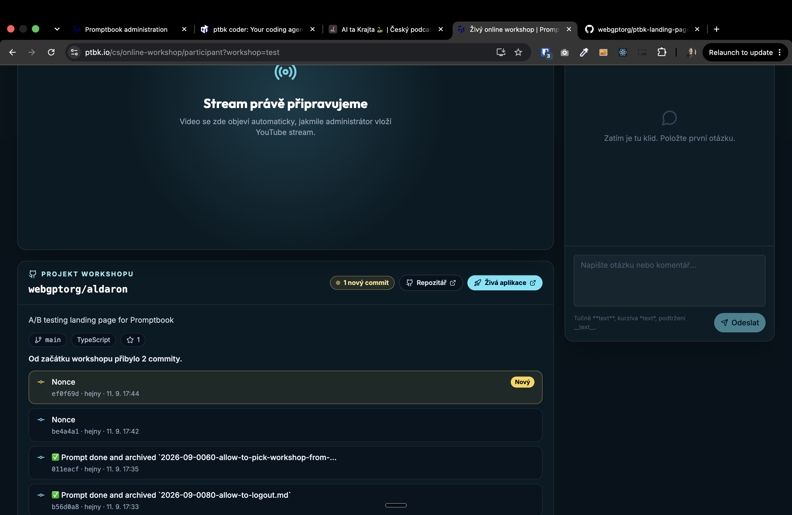
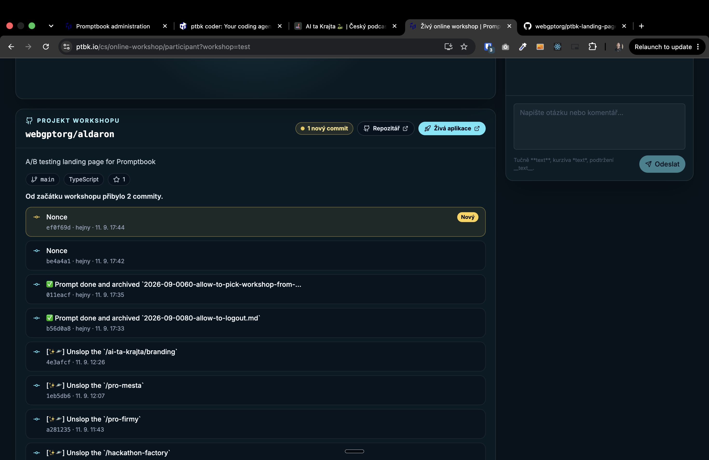
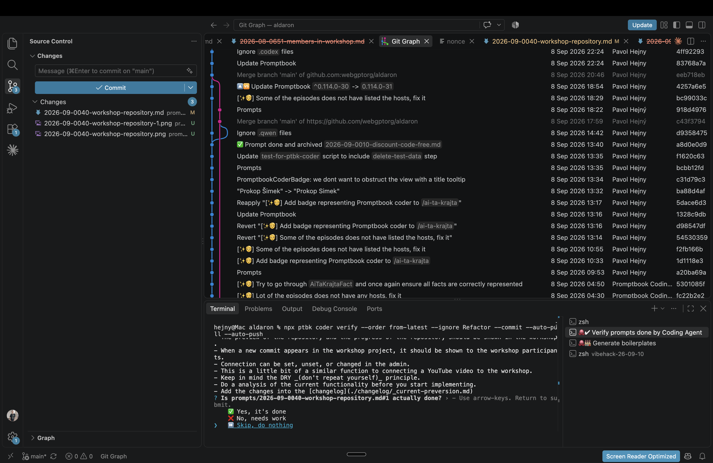

[x] by Claude Code `claude-opus-5` thinking `max` - Implementation 5.49 5 hours; Testing 8 minutes

[✨🤌] There should be an option to connect a project with a workshop.

- Allow to set the GitHub repository and optionally branch and deployment URL, which is the subject of the workshop
- The preview of the repository and the progress of the repository should be shown in the workshop.
- When a new commit appears in the workshop project, it should be shown to the workshop participants.
- Connection can be set, unset, or changed in the admin.
- This is a little bit of a similar function to connecting a YouTube video to the workshop.
- Keep in mind the DRY _(don't repeat yourself)_ principle.
- Do a analysis of the current functionality before you start implementing.
- Add the changes into the [changelog](./changelog/_current-preversion.md)

---

[ ]

[✨🤌] Cleanup the project connected to the workshop, removing unnecessary information

This should not be shown:

```
A/B testing landing page for Promptbook

main
TypeScript
1
Od začátku workshopu přibylo 2 commity.
```

- Show only the basic information and commits.
- Keep in mind the DRY _(don't repeat yourself)_ principle.
- Do a analysis of the current functionality before you start implementing.
- Add the changes into the [changelog](./changelog/_current-preversion.md)



---

[ ]

[✨🤌] Allow multiple branches for the project connected to the workshop.

- Allow one branch, multiple selected branches, or all branches.
- When showing more branches, show the commits from all the branches.
- When showing multiple branches, do not show a simple list of the commits, but the proper graph similar to VSCode Git Graph.
- Keep in mind the DRY _(don't repeat yourself)_ principle.
- Do a analysis of the current functionality before you start implementing.
- Add the changes into the [changelog](./changelog/_current-preversion.md)




---

[ ]

[✨🤌] When a new commit appears in the connected project to the workshop, show it as a notification.

- Use similar patterns to the pinned messages or reactions
- The newly appeared commit should be on stage for 10 seconds.
- New commits should appear automatically without the need for the user to refresh the page, similar to other things like reactions or comments
- But do not overwhelm the GitHub API with too frequent requests, do some smart caching pooling
- Keep in mind the DRY _(don't repeat yourself)_ principle.
- Do a analysis of the current functionality before you start implementing.
- Add the changes into the [changelog](./changelog/_current-preversion.md)
