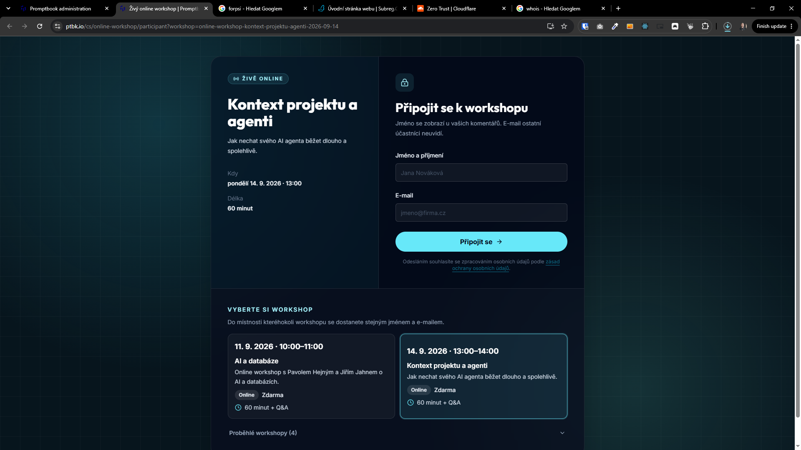

[x] by Claude Code `claude-opus-5` thinking `max` - Implementation 3.78 5 hours; Testing 8 minutes

[✨🪃] Allow picking from all available online workshops from the waiting room.

- You are working with page `/cs/online-workshop/participant`
- Keep in mind the DRY _(don't repeat yourself)_ principle.
- Do a analysis of the current functionality before you start implementing.
- Add the changes into the [changelog](./changelog/_current-preversion.md)

---

[x] (2 attempts) by Claude Code `claude-opus-5` thinking `max` - Implementation $4.05 4 hours; Testing 9 minutes; Fixing $2.34 21 minutes; Testing 24 minutes

[✨🪃] Picking available online workshops from the waiting room should be little bit smaller and less prominent.

- You are working with page `/cs/online-workshop/participant`
- Keep in mind the DRY _(don't repeat yourself)_ principle.
- Do a analysis of the current functionality before you start implementing.
- Add the changes into the [changelog](./changelog/_current-preversion.md)

