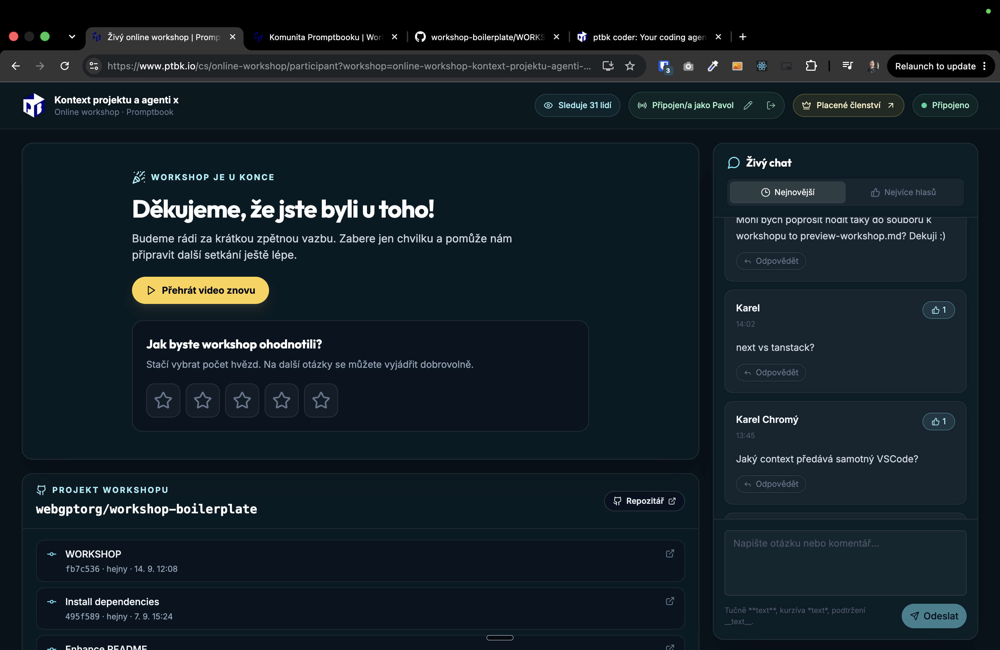

[x] by Developer on OpenAI Codex `gpt-6-astra` thinking `max` (ChatGPT account) - Implementation ~$0.3951 17 minutes; Testing 12 minutes

[✨🧪] After the workshop has ended, there should be multiple things added to the follow-up / wrap-up

- For non-paying members, there should be a primary call-to-action button to purchase the membership.
- For all people, there should be a link to the next upcomming workshop.
- For all people, there should also be a link to the next paid upcoming workshop.
- For all people, there should be a button link to the community.
    - There is also a link to community among materials, but this call-to-action button should be extra.
- All of these things should be shown after the workshop has ended in the stage area where the video was
- You are working with page `/cs/online-workshop/participant?workshop=`
- Keep in mind the DRY _(don't repeat yourself)_ principle.
- Do a analysis of the current functionality before you start implementing.
- Add the changes into the [changelog](./changelog/_current-preversion.md)

