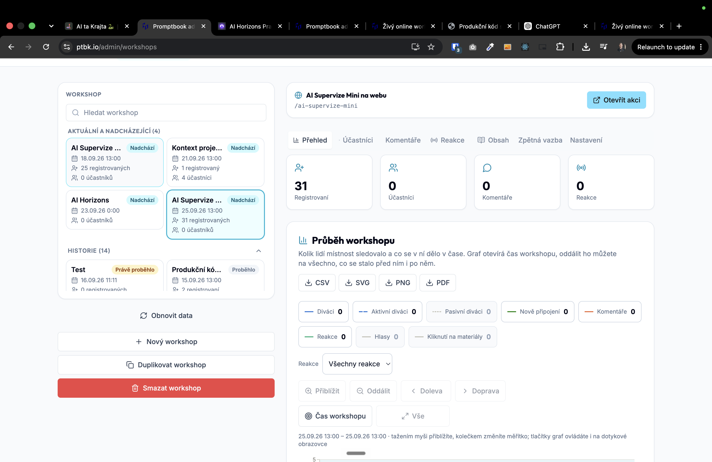

[x] by Developer on Claude Code `claude-opus-5` thinking `max` - Implementation $9.49 17 minutes; Testing 9 minutes

[✨🌷] When the event is freshly passed (last 24 hours), do not show it as a standard event from last week, but in some special way.

- There should be four categories of events from the time perspective:
    1. Upcoming events
    2. Ongoing events
    3. Freshly past events - Are adding this
    4. Past events
- You are working with page `/cs/online-workshop/participant?workshop=` and `/cs/komunita`
- Keep in mind the DRY _(don't repeat yourself)_ principle.
- Do a analysis of the current functionality before you start implementing.
- Add the changes into the [changelog](./changelog/_current-preversion.md)

---

[x] by Developer on Claude Code `claude-opus-5` thinking `max` - Implementation $4.04 12 minutes; Testing 11 minutes
[✨🌷] In administration, show freshly past events under the primary current events category, not in the history.

- Do not change anything in the data, just how you are showing the events in the administration.

