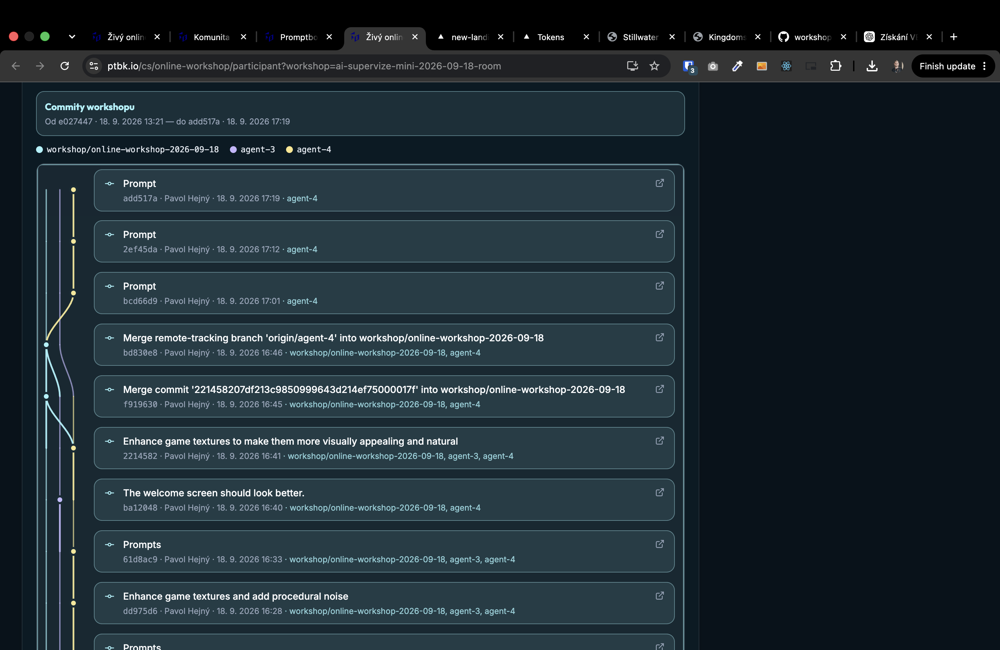

[x] by Developer on OpenAI Codex `gpt-6-astra` thinking `max` (ChatGPT account) - Implementation ~$0.4170 21 minutes; Testing 16 minutes

[✨💩] After the workshop has ended, allow to download a wrap-up PDF

- The wrap-up PDF should include a summary of the workshop, key takeaways, and any materials shared during the session.
- Do not add anything into the admin or database. The wrap-up PDF should be generated from information already there.
- You are working with page `/cs/online-workshop/participant?workshop=`
- Keep in mind the DRY _(don't repeat yourself)_ principle.
- Do a analysis of the current functionality before you start implementing.
- Add the changes into the [changelog](./changelog/_current-preversion.md)

---

[x] by Developer on OpenAI Codex `gpt-6-astra` thinking `max` (ChatGPT account) - Implementation .90 20 minutes; Testing 5 minutes

[✨💩] Add branding and better visual design to the wrap-up PDF

- After the workshop has ended, you can download a wrap-up PDF
- The wrap-up PDF should look premium and visually appealing - including branding elements like logos, colors, and fonts consistent with the workshop's theme.
- It should be suitable for sharing with participants and stakeholders, reflecting the professionalism of the workshop but also to be printable on standard A4 paper.
- There should be QR code linking to the `/cs/online-workshop/participant?workshop=` page.
    - It should lead through shortener by ad-hoc created short URL.
- Also print the GIT graph from materials
  
- And put there a preview of the workshop project
- You are working with page `/cs/online-workshop/participant?workshop=` with the wrap-up PDF functionality.
- Keep in mind the DRY _(don't repeat yourself)_ principle.
- Do a analysis of the current functionality before you start implementing.
- Add the changes into the [changelog](./changelog/_current-preversion.md)

----

@@@@@@@ Call to action in wrap up