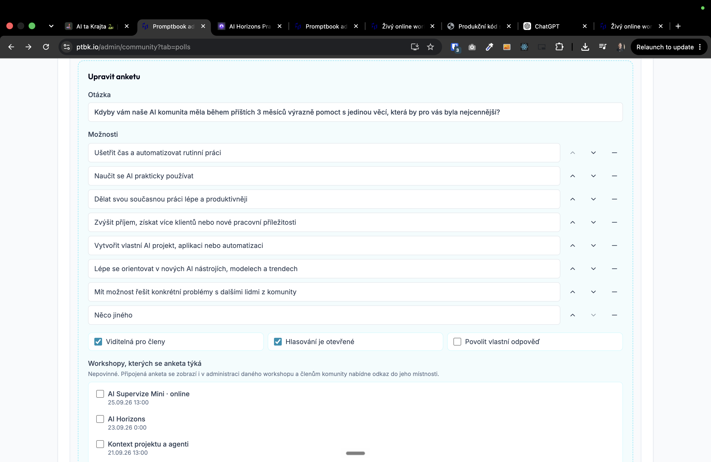

[x] by Developer on OpenAI Codex `gpt-5.6-terra` thinking `max` (ChatGPT account) - Implementation ~$0.6794 23 minutes; Testing 9 minutes

[✨🪱] Allow the polls to have an "Other" option, and every user can write his own option, and other users can vote for his options.

- When the user writes his own option, he automatically votes for it.
- You are working with page `/cs/online-workshop/participant?workshop=` and `/cs/komunita`
- Keep in mind the DRY _(don't repeat yourself)_ principle.
- Do a analysis of the current functionality before you start implementing.
- Add the changes into the [changelog](./changelog/_current-preversion.md)

---

[ ]

[✨🪱] Custom options in the polls submitted by users should require approval

- The approval should work in exactly the same way as the chat comments.
    - Moderators and trusted users should have their options auto-approved.
- Also, in administration, admins should be able to see which user created the option.
- Vote is automatically counted for the user who created the option but until it is approved, it may not be visible to other users.
- You should be also able to manage theese custom options in the administration panel and allow to edit / delete them
    - 
- You are working with page `/cs/online-workshop/participant?workshop=` and `/cs/komunita`
- Keep in mind the DRY _(don't repeat yourself)_ principle.
- Do a analysis of the current functionality before you start implementing.
- Add the changes into the [changelog](./changelog/_current-preversion.md)
