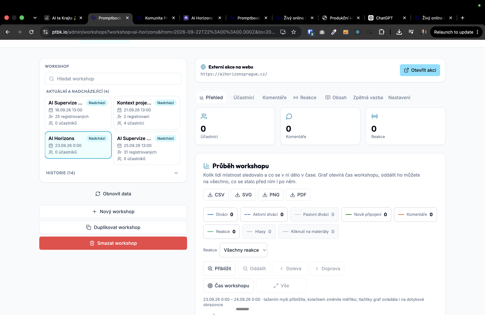
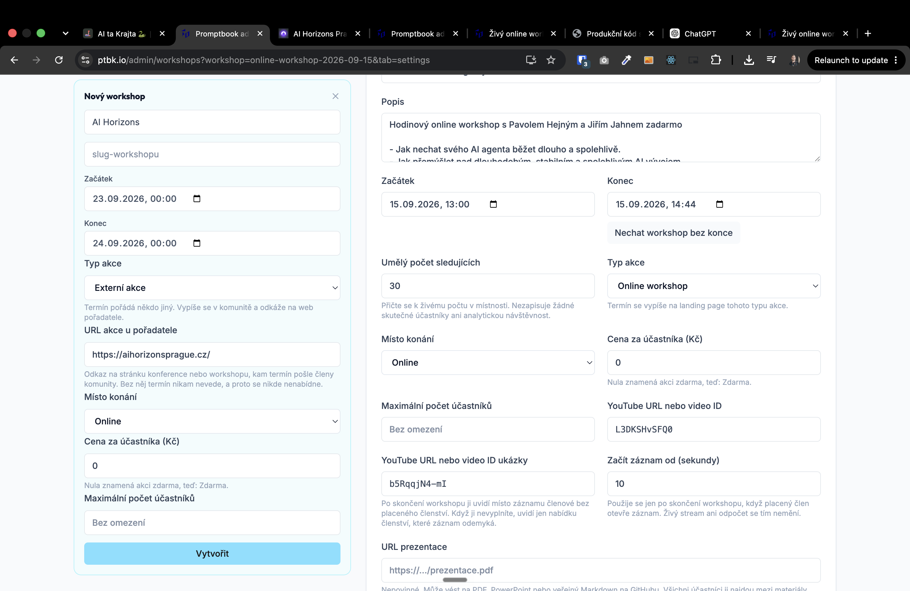

[x] by Developer on Claude Code `claude-opus-5` thinking `max` - Implementation 6.80 30 minutes; Testing 9 minutes

[✨🧄] Allow adding external events

- The purpose of the external events is the ability to add links to external conferences and workshops done by the lectures of the community.
- You are working with page `/cs/komunita`
- Keep in mind the DRY _(don't repeat yourself)_ principle.
- Do a analysis of the current functionality before you start implementing.
- Add the changes into the [changelog](./changelog/_current-preversion.md)

---

[ ]

[✨🧄] Modifying the way of adding external events

- Change "Work"
    - For example "Živé workshopy" ->
    - Chamge also the admin url slugs
        - Do not keep the backward-compatible slugs.

@@@@
Nový workshop
AI Horizons
slug-workshopu
Začátek
23.09.2026, 00:00
Konec
24.09.2026, 00:00
Typ akce
Externí akce
Termín pořádá někdo jiný. Vypíše se v komunitě a odkáže na web pořadatele.
URL akce u pořadatele
https://aihorizonsprague.cz/
Odkaz na stránku konference nebo workshopu, kam termín pošle členy komunity. Bez něj termín nikam nevede, a proto se nikde nenabídne.
Místo konání
Online
Cena za účastníka (Kč)
0
Nula znamená akci zdarma, teď: Zdarma.
Maximální počet účastníků
Bez omezení

- Also, it doesn't make sense for external events to have things like the timeline, materials, etc. They should be only:
    - the name of the event
    - the basic metadata
    - start
    - end
    - URL
    - 
- You are working with page `/cs/komunita` and `/admin/workshops`
- Keep in mind the DRY _(don't repeat yourself)_ principle.
- Do a analysis of the current functionality before you start implementing.
- Add the changes into the [changelog](./changelog/_current-preversion.md)

