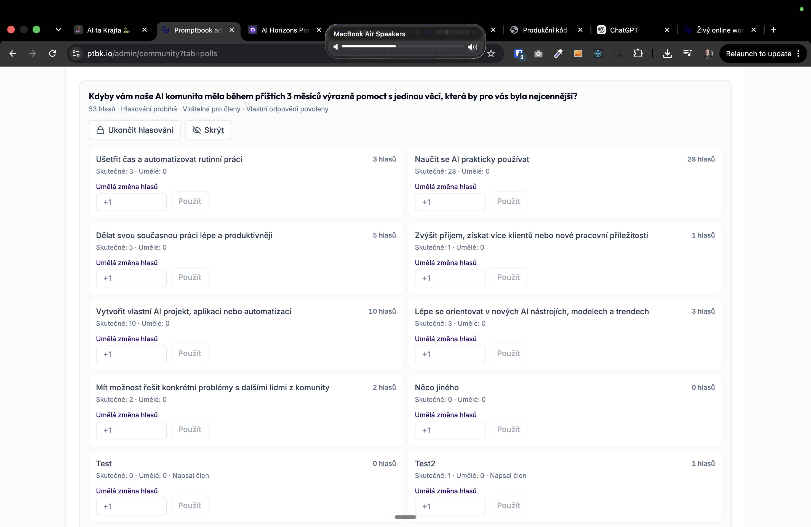

[ ]

[✨🔐] qux

- @@@@@@@
- You should be able to see the polling info in the extra information appended to the contacts. - You are working with page `/admin/community?tab=polls` and `/admin/contacts`
- Keep in mind the DRY _(don't repeat yourself)_ principle.
- Do a analysis of the current functionality before you start implementing.
- Add the changes into the [changelog](./changelog/_current-preversion.md)

