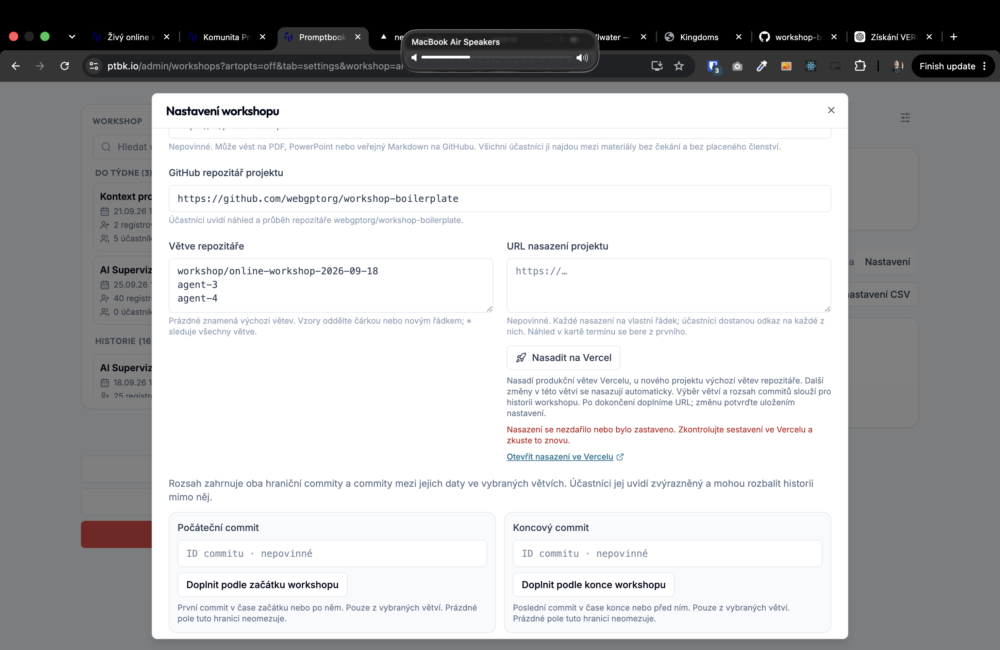

[x] by Developer on OpenAI Codex `gpt-6-astra` thinking `max` (ChatGPT account) - Implementation ~$0.4050 18 minutes; Testing 13 minutes

[✨🐭] Allow the workshop project to be auto deployed on Vercel

- For each online workshop, you can set the project repository and project deployment.
- If the Project deployment isn't set, allow to auto deploy it on Vercel
- You are working with the workshop project repository.
- You are working with `/admin/workshops`
- Keep in mind the DRY _(don't repeat yourself)_ principle.
- Do a analysis of the current functionality before you start implementing.
- Add the changes into the [changelog](./changelog/_current-preversion.md)

---

[x] by Developer on OpenAI Codex `gpt-6-astra` thinking `max` (ChatGPT account) - Implementation ~$0.3129 12 minutes; Testing 6 minutes

[✨🐭] When the deployment on Vercel fails, provide some useful error messages and guidance to the user.

- Now it just tells "Nasazení se nezdařilo nebo bylo zastaveno. Zkontrolujte sestavení ve Vercelu a zkuste to znovu."

---

@@@@@@@on domain ptbk.io