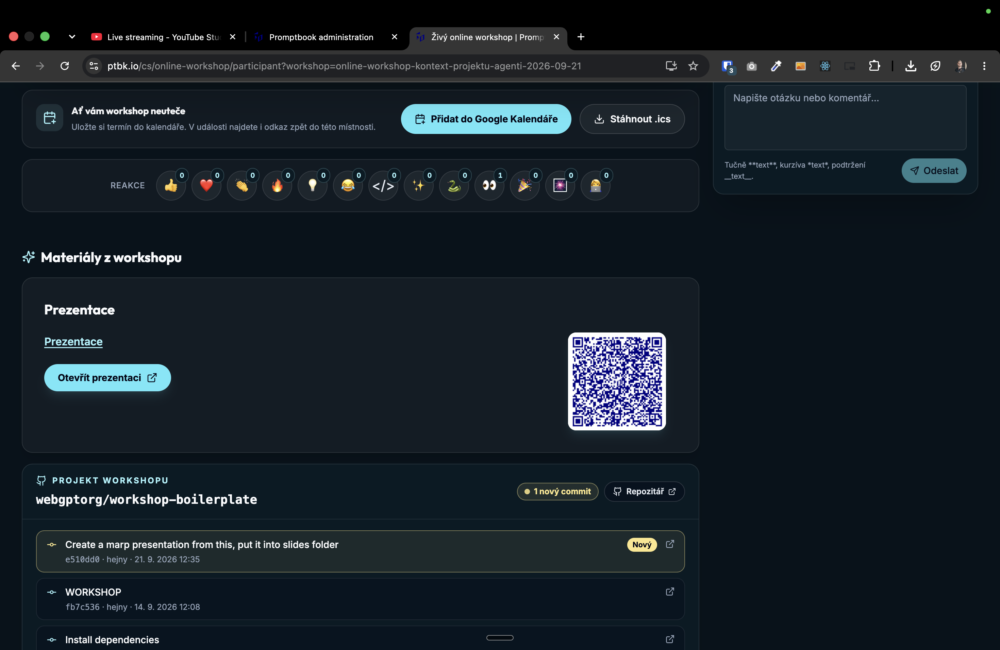

[ ]

[✨🪝] foo

- @@@@@@@@@@
- Place presentation into PDF material wrap-up
- Also the QR code should go throught ad-hoc shortening same as
- You are working with page `/cs/@@@`
- Keep in mind the DRY _(don't repeat yourself)_ principle.
- Do a analysis of the current functionality before you start implementing.
- Add the changes into the [changelog](./changelog/_current-preversion.md)

